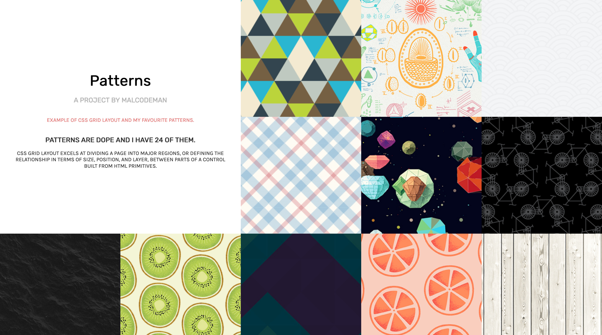

# Patterns 🏁

Neat example of CSS Grid and collection of my favourite patterns.

Thank to [CSS grid](https://developer.mozilla.org/en-US/docs/Web/CSS/CSS_Grid_Layout) layout system patterns are mobile ready and infinitely scalable.

Patterns are stored in JSON object which includes name, author and their relative url.

[Shuffle algorithm](https://en.wikipedia.org/wiki/Fisher%E2%80%93Yates_shuffle) was used to make things more fun.

## Assets

- [Karla font](https://fonts.google.com/specimen/Karla)
- [Rubik font](https://fonts.google.com/specimen/Rubik)

## License

This project is licensed under the MIT License - see the [LICENSE](LICENSE) file for details.
